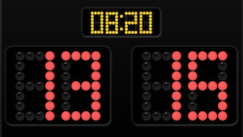
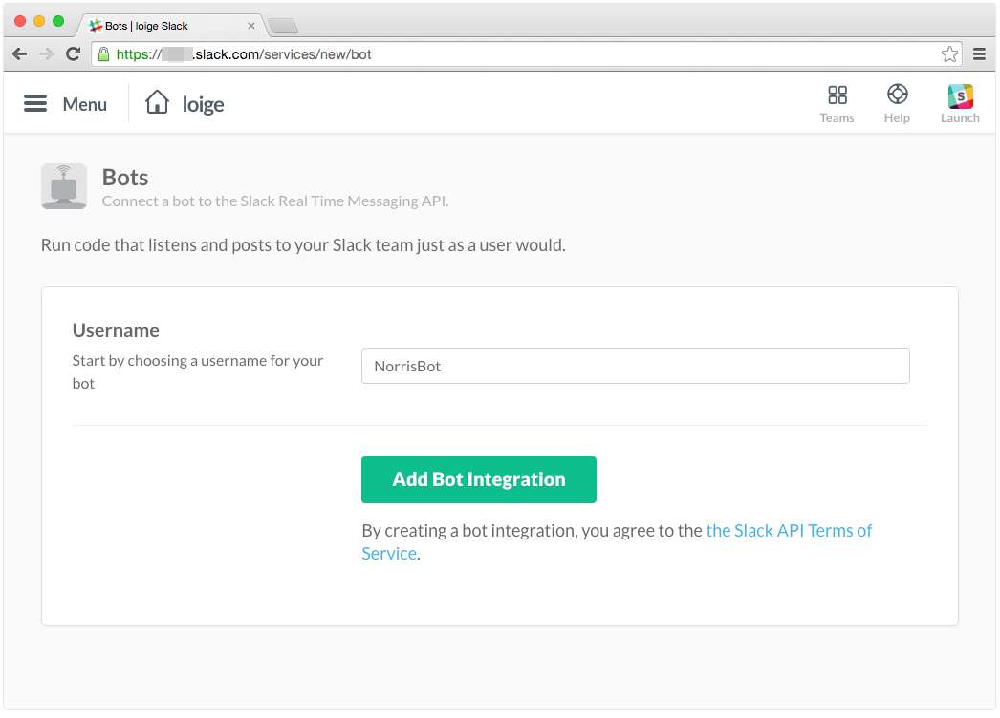
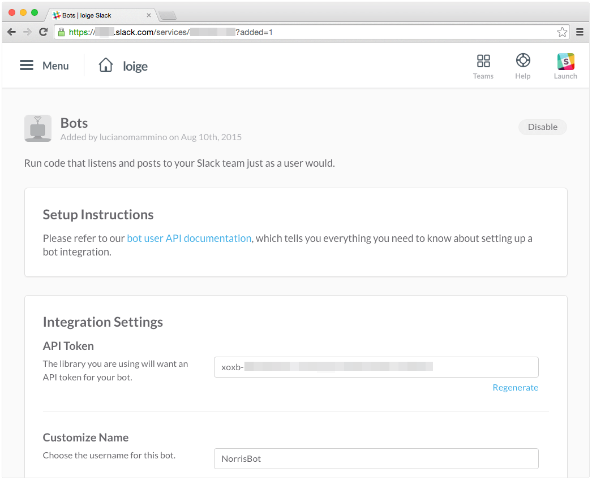

Scoreboard
==========



[Helpful Tutorial Here!!!](https://scotch.io/tutorials/building-a-slack-bot-with-node-js-and-chuck-norris-super-powers)

### Commands

- `@gotit` - This command gives you a point for responding to a learner.
- `@score` - This command gives you back the tally of the scores for each coach.

### Development

To add a new Bot in your Slack organization you must visit the following url: https://yourorganization.slack.com/services/new/bot, where yourorganization must be substituted with the name of your organization



Once you set a name for your bot, you will move to another screen where you will be able to copy your API token.
Copy the token in a safe place and save it, you will need it in a while.



#### Getting Started:
- Export your slack token:
```
export SLACKBOT_TOKEN=X527-REALLY_LONG_SLACK_TOKEN-8559F
```

- Clone:
```
git clone git@github.com:Jusdev89/Scoreboard.git
```

- Install Yarn 
```
npm i -g yarn
```

- Install Packages: 
```
yarn
```

- Start your Bot:
```
npm run start:dev
```

Now try the commands from above
-------------------------------
